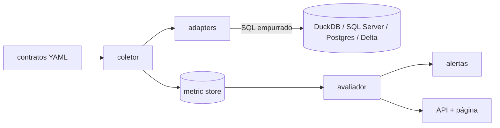

# obsdados

Serviço de observabilidade de dados: não move dado, observa dado que já foi
movido por outro pipeline. O problema que resolve é o pipeline que termina com
sucesso e mente — job verde, zero exceção, e a tabela chegou com metade do
volume, uma coluna a mais ou o dado de ontem. Nenhum dos meus outros projetos de
engenharia de dados (CDC, ELT, lakehouse, streaming, ingestão de API) tem
qualquer garantia de que o dado que chegou do outro lado é o dado certo — esse
é o vazio que este projeto cobre.

A regra que define a arquitetura inteira: dado bruto nunca sai do banco de
origem. Toda métrica é calculada por SQL executado no próprio backend
observado, e só o valor agregado trafega de volta para o processo Python. Um
coletor que faz `SELECT *` e conta linha em Python funciona numa tabela de
teste e derruba o ambiente na primeira tabela de 30 milhões de linhas — então
essa regra é testada, não só documentada.

Este é um projeto em fases. O que existe hoje é a Fase 1: o núcleo, o
protocolo de adapter, o adapter DuckDB de referência e o metric store. As
fases seguintes (catálogo completo de métricas, contratos e detecção
estatística, alertas e API, integração com os outros projetos do portfólio)
ainda não foram construídas.

## Arquitetura



Hoje só existem os blocos `coletor`, `adapters` (DuckDB) e `metric store`. O
resto do diagrama é o destino, não o estado atual.

## O que tem na Fase 1

- **Protocolo `Adaptador`** (`obsdados/adaptador.py`) — o contrato que todo
  backend de origem implementa: listar datasets, descrever schema, declarar
  capacidades, executar uma métrica.
- **Negociação de capacidade** — o coletor consulta o que o adapter suporta
  antes de pedir a métrica. Quando falta suporte, o resultado tem status
  `nao_suportado` com o motivo — nunca um valor ausente sem explicação.
- **Adapter DuckDB** (`obsdados/adaptadores/adaptador_duckdb.py`) — o backend
  de referência, mais simples que os que virão depois.
- **Enforcement de push-down** (`obsdados/instrumentacao.py`) — a conexão do
  adapter é instrumentada para contar linhas efetivamente buscadas do driver.
  Um teste de contrato genérico verifica esse limite para qualquer adapter, e
  um segundo teste registra de propósito um adapter que faz `SELECT *` e conta
  em Python, provando que esse adapter *falharia* o contrato.
- **Metric store em DuckDB** (`obsdados/db.py`, `obsdados/armazenamento.py`) —
  histórico de `(dataset, métrica, dimensão, timestamp, valor)`.
- **CLI** (`obsdados/cli.py`) — `obsdados coletar` e `obsdados historico`.
- **Log estruturado em JSON** via `structlog`, com dataset, métrica, duração e
  linhas trafegadas em cada coleta.

## Instalação e uso

```bash
uv sync --extra dev
```

Coletar uma métrica de uma tabela DuckDB e gravar no metric store:

```bash
obsdados coletar \
  --backend duckdb \
  --db-origem origem.duckdb \
  --tabela vendas.pedidos \
  --dataset vendas.pedidos \
  --tipo-metrica contagem_linhas \
  --store metricas.duckdb
```

Ler o histórico de um dataset:

```bash
obsdados historico --store metricas.duckdb --dataset vendas.pedidos
```

O resultado da coleta sai como uma linha JSON em stdout; o log estruturado vai
para stderr. Os dois nunca se misturam, então dá para redirecionar a saída de
resultado para um arquivo ou pipe sem filtrar log no meio.

### Números medidos

Rodando a coleta localmente contra duas tabelas DuckDB, uma com 1.234 linhas e
outra com 500.000:

| tabela          | linhas  | linhas trafegadas  | duração da coleta  |
|-----------------|---------|--------------------|--------------------|
| pedidos_pequena | 1.234   | 1                  | 0,77 ms            |
| pedidos_grande  | 500.000 | 1                  | 0,74 ms            |

A duração não muda com o tamanho da tabela porque o `COUNT(*)` roda inteiro
dentro do DuckDB; só o resultado agregado atravessa para o Python. É essa
independência entre tamanho da origem e custo do lado do coletor que a regra
de push-down existe para garantir. (Números de uma máquina de desenvolvimento
comum — servem para mostrar a ordem de grandeza, não para prometer um SLA.)

A suíte de testes completa (23 testes, incluindo o teste de concorrência com
processos reais) roda em cerca de 1,4 segundo.

## Decisões e trade-offs

**Push-down como invariante testada, não como convenção.** A conexão DuckDB do
adapter é envolvida por `ConexaoInstrumentadaDuckDB`, que conta toda linha que
passa por `fetchone`/`fetchmany`/`fetchall`. Um teste de contrato genérico
verifica esse número para qualquer adapter; um teste separado registra um
adapter deliberadamente ruim, que faz `SELECT *` e conta em Python, e prova que
ele excede o limite e que o contrato o rejeita. Sem esse segundo teste, o
primeiro não prova nada — só mostra que o adapter *que eu escrevi direito* se
comporta bem.

**`Protocol` em vez de classe abstrata para o adapter.** Tipagem estrutural em
vez de herança: um adapter novo não precisa herdar de nada, só ter os métodos
certos. Isso também é o que permite o adapter ruim do teste acima existir sem
herdar de `AdaptadorDuckDB` — ele só precisa ter a forma certa para ser testado
com a mesma suíte.

**Metric store em DuckDB, com escrita curta em vez de concorrência real.**
Cheguei a assumir que DuckDB resolveria "um processo escreve, outro lê" do
jeito que o SQLite resolve com WAL — não resolve. Testei e confirmei: uma
conexão `read_only=True` não abre enquanto existe uma conexão de escrita ativa
no mesmo arquivo; o erro é imediato, não uma espera. A solução que fica é
outra: o coletor abre, grava, roda `CHECKPOINT` e fecha rápido; quem lê tenta
abrir em modo leitura com um número limitado de tentativas e espera curta entre
elas. Isso é sequenciamento com retry, não paralelismo — e está descrito assim
de propósito, para não prometer uma garantia que o mecanismo não entrega. O
teste de concorrência sobe um segundo processo de verdade (não uma thread) e
prova as duas pontas: que o lock é real e que o retry funciona depois que o
escritor libera o arquivo.

**Schema do metric store já pronto para as métricas que ainda não existem.**
A tabela `historico_metrica` já tem colunas para status, tipo de amostragem,
motivo de não suporte e parâmetros da métrica, mesmo a Fase 1 só populando uma
fração delas. A ideia é não precisar de `ALTER TABLE` quando o catálogo de
métricas crescer.

**Nenhum `sleep` fixo em teste, nem em código.** O teste de concorrência usa
`multiprocessing.Event` para saber quando o outro processo realmente conectou
ou realmente gravou, em vez de dormir um tempo arbitrário e torcer. O retry de
leitura do metric store é limitado e determinístico (número de tentativas fixo,
função de espera injetável), não uma tentativa única com sorte.

**Sem machine learning.** A detecção deste projeto, mesmo nas fases futuras,
é estatística simples e explicável — mediana móvel com desvio absoluto
mediano, não um modelo. Um alerta que ninguém no time consegue justificar em
uma frase é um alerta que é desligado na segunda semana.

## Por que não Great Expectations, Soda ou Elementary

Essas ferramentas resolvem qualidade e observabilidade de dados de verdade, e
bem. Não uso nenhuma delas aqui de propósito: o ponto deste projeto é construir
o mecanismo — push-down real, negociação de capacidade, o próprio metric store
— não configurar uma ferramenta pronta. Isso é uma escolha de portfólio, não
uma alegação de que dá para reescrever essas ferramentas em uma tarde.

Na vida real, a escolha seria diferente:

- **Great Expectations** — quando já existe um time de dados maduro e o
  trabalho é definir expectativas declarativas sobre datasets conhecidos, com
  um ecossistema de checkpoints e documentação automática já pronto.
- **Soda** — quando o objetivo é qualidade de dados com checks declarativos em
  YAML e integração rápida com stack existente, sem querer manter
  infraestrutura própria de coleta.
- **Elementary** — quando o projeto já é construído em dbt e faz sentido que a
  observabilidade viva dentro do mesmo grafo de modelos, aproveitando o
  metadata que o dbt já produz.

Eu escolheria uma dessas três antes de escolher este projeto para produção. O
valor daqui é entender e conseguir explicar cada peça do mecanismo por baixo.

## Roteiro de validação

Em uma máquina limpa, com Python 3.12 e `uv` instalados:

```bash
git clone <repositório>
cd projeto-observalidade-dados
uv sync --extra dev
uv run pytest
uv run ruff check .
uv run mypy obsdados
```

Para ver o fluxo completo funcionando:

```bash
uv run python -c "
import duckdb
con = duckdb.connect('origem.duckdb')
con.execute('CREATE TABLE pedidos AS SELECT * FROM range(1000) AS t(id)')
con.close()
"
uv run obsdados coletar --backend duckdb --db-origem origem.duckdb \
  --tabela pedidos --dataset teste.pedidos --tipo-metrica contagem_linhas \
  --store metricas.duckdb
uv run obsdados historico --store metricas.duckdb --dataset teste.pedidos
```

Nenhum dos dois arquivos `.duckdb` gerados aqui deve ser commitado — o
`.gitignore` já cobre isso.

## Próximos passos

- **Fase 2** — catálogo completo de métricas (frescor, volume, schema,
  distribuição), amostragem configurável, segundo adapter (SQL Server ou
  Postgres).
- **Fase 3** — contratos declarativos em YAML, baseline com mediana móvel e
  MAD, sazonalidade por dia da semana, incidentes.
- **Fase 4** — alertas por webhook com deduplicação, API em FastAPI, página
  estática, agendamento idempotente.
- **Fase 5** — integração com os projetos reais do portfólio, Docker Compose,
  CI, demonstração de incidentes de verdade.
