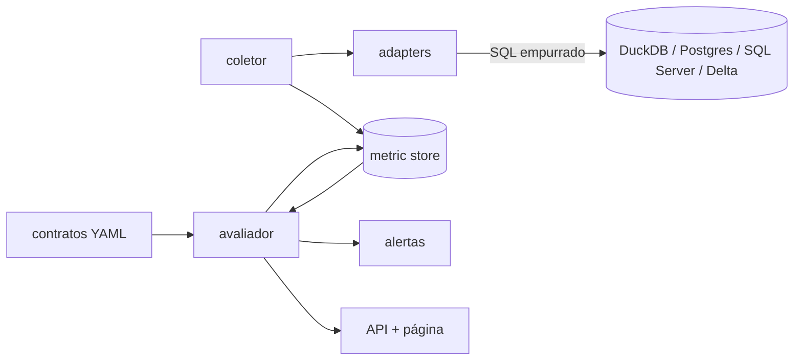

# obsdados

Serviço de observabilidade de dados: não move dado, observa dado que já foi
movido por outro pipeline. O problema que resolve é o pipeline que termina com
sucesso e mente — job verde, zero exceção, e a tabela chegou com metade do
volume, uma coluna a mais ou o dado de ontem. Nenhum dos meus outros projetos de
engenharia de dados (CDC, ELT, lakehouse, streaming, ingestão de API) tem
qualquer garantia de que o dado que chegou do outro lado é o dado certo — esse
é o vazio que este projeto cobre.

A regra que define a arquitetura inteira: dado bruto nunca sai do banco de
origem. Toda métrica é calculada por SQL executado no próprio backend
observado, e só o valor agregado trafega de volta para o processo Python. Um
coletor que faz `SELECT *` e conta linha em Python funciona numa tabela de
teste e derruba o ambiente na primeira tabela de 30 milhões de linhas — então
essa regra é testada, não só documentada.

Este é um projeto em fases:

- [x] **Fase 1** — núcleo, protocolo de adapter, adapter DuckDB de referência, metric store.
- [x] **Fase 2** — catálogo completo de métricas, segundo adapter (Postgres), amostragem, política de vazamento.
- [x] **Fase 3** — contratos em YAML, baseline com mediana móvel e MAD, detecção de incidente.
- [ ] **Fase 4** — alertas por webhook, API, página, agendamento.
- [ ] **Fase 5** — integração real, Docker Compose completo, CI.

## Arquitetura



Hoje existem `coletor`, `adapters` (DuckDB e Postgres), `metric store` e
`avaliador` (que lê o contrato e o metric store, e escreve incidente de volta
no store). `alertas` e `API + página` são o destino, ainda não construído.

## O que o serviço faz hoje

- **Protocolo `Adaptador`** (`obsdados/adaptador.py`) — o contrato que todo
  backend de origem implementa: listar datasets, descrever schema, declarar
  capacidades, executar uma métrica.
- **Negociação de capacidade** — o coletor consulta o que o adapter suporta
  antes de pedir a métrica. Quando falta suporte, o resultado tem status
  `nao_suportado` com o motivo — nunca um valor ausente sem explicação.
- **Dois adapters** — DuckDB (`adaptador_duckdb.py`) e Postgres
  (`adaptador_postgres.py`), mesmo catálogo de métricas, dialeto próprio cada
  um.
- **Enforcement de push-down** (`obsdados/instrumentacao.py`) — a conexão do
  adapter é instrumentada para contar linhas efetivamente buscadas do driver.
  Um teste de contrato genérico verifica esse limite para as quatro famílias
  de métrica em ambos os backends, e um segundo teste registra de propósito um
  adapter que faz `SELECT *` e conta em Python, provando que esse adapter
  *falharia* o contrato.
- **Catálogo de métricas** (`obsdados/nucleo.py`, um método por família em
  cada adapter):
  - **Frescor** — `now() - MAX(coluna)`, em segundos.
  - **Volume** — contagem total, ou por partição/dia quando `dimensao` e
    `coluna` são informados.
  - **Schema** — hash do conjunto de colunas/tipos/nulabilidade
    (`obsdados/schema.py`), mais uma função pura que classifica a diferença
    entre dois snapshots como aditiva ou quebradora.
  - **Distribuição** — taxa de nulos, cardinalidade aproximada, mínimo,
    máximo, quantil — com amostragem automática em tabela grande.
- **Amostragem configurável por tamanho** — acima de 100 mil linhas
  estimadas (lidas do catálogo do banco, sem varredura), métricas de
  distribuição usam `TABLESAMPLE`/`USING SAMPLE` em vez de varredura
  completa. O resultado registra de qual dos dois veio.
- **Política de materialização de valor** — mínimo, máximo e quantil só
  calculam o valor real se a chamada vier com `parametros.permite_valor=true`
  (CLI: `--permite-valor`). Sem isso, o resultado é `nao_suportado` com o
  motivo explícito. Continua um controle por chamada, não por coluna dentro
  do contrato — o contrato desta fase cobre frescor/volume/schema/nulos, não
  esse mecanismo.
- **Metric store em DuckDB** (`obsdados/db.py`, `obsdados/armazenamento.py`) —
  histórico de `(dataset, métrica, coluna, dimensão, timestamp, valor)`, mais
  a tabela de incidentes.
- **Contrato declarativo em YAML** (`obsdados/contrato.py`) — um arquivo por
  dataset, validado com Pydantic v2. Erro de sintaxe YAML e erro de schema
  (campo obrigatório ausente, tipo errado, campo desconhecido) apontam a
  linha do problema. Descreve conexão, tabela, regra de frescor (SLA),
  regra de volume (severidade, mínimo de observações, limite de desvio),
  regra de schema (severidade por tipo de mudança), regras de nulos por
  coluna e política de amostragem. Exemplo em `contratos/exemplo.yaml`.
- **Baseline com mediana e MAD, nunca média com desvio padrão**
  (`obsdados/baseline.py`) — uma carga anômala contamina a própria média, e a
  detecção fica cega justo depois do incidente. Mediana e desvio absoluto
  mediano resistem a um outlier isolado no histórico.
- **Sazonalidade por dia da semana** — a baseline de volume é calculada
  separadamente por dia da semana: volume de sábado nunca é comparado contra
  a mediana de segunda-feira.
- **Partida a fria** — sem `minimo_observacoes_baseline` (padrão 5) pontos do
  mesmo dia da semana no histórico, o incidente estatístico de volume fica
  suspenso; as regras por limiar do contrato (frescor, nulos, schema)
  continuam valendo desde a primeira coleta.
- **Severidade com efeito distinto, hoje** — aviso/erro/crítico definem o
  código de saída de `obsdados avaliar` (0/1/2). Antes de existir alerta
  (Fase 4), já dá pra usar isso para falhar um pipeline de CI.
- **Incidente persistido com ciclo de vida** (`obsdados/incidente.py`) — cada
  disparo vira uma linha com valor observado, esperado, desvio e
  justificativa. Um incidente já aberto não duplica na rodada seguinte, e se
  resolve sozinho quando a condição deixa de valer.
- **Avaliador só lê o metric store, nunca a origem** (`obsdados/avaliador.py`)
  — inclusive o snapshot de colunas usado para classificar mudança de schema
  já foi coletado antes; avaliar um dataset não abre conexão nova com o banco
  observado.
- **CLI** (`obsdados/cli.py`) — `obsdados coletar`, `obsdados historico` e
  `obsdados avaliar`, contra DuckDB ou Postgres.
- **Log estruturado em JSON** via `structlog`, com dataset, métrica, duração e
  linhas trafegadas em cada coleta.

## Instalação e uso

```bash
uv sync --extra dev
```

O adapter Postgres precisa de um banco para testar contra. Suba um container
isolado (não toca em nenhum Postgres que já exista na máquina):

```bash
docker compose up -d postgres
cp .env.example .env   # os valores padrão já batem com o compose acima
```

Coletar uma métrica de uma tabela e gravar no metric store:

```bash
obsdados coletar \
  --backend duckdb \
  --db-origem origem.duckdb \
  --tabela vendas.pedidos \
  --dataset vendas.pedidos \
  --tipo-metrica contagem_linhas \
  --store metricas.duckdb
```

Outras métricas do catálogo (mesma sintaxe, troca `--tipo-metrica` e o que for
preciso):

```bash
# frescor: exige a coluna com o timestamp de referência
obsdados coletar --backend duckdb --db-origem origem.duckdb --tabela vendas.pedidos \
  --dataset vendas.pedidos --tipo-metrica frescor --coluna criado_em --store metricas.duckdb

# taxa de nulos de uma coluna
obsdados coletar --backend duckdb --db-origem origem.duckdb --tabela vendas.pedidos \
  --dataset vendas.pedidos --tipo-metrica taxa_nulos --coluna valor --store metricas.duckdb

# máximo — bloqueado por padrão, precisa de --permite-valor
obsdados coletar --backend duckdb --db-origem origem.duckdb --tabela vendas.pedidos \
  --dataset vendas.pedidos --tipo-metrica maximo --coluna valor --permite-valor --store metricas.duckdb

# contra Postgres, credenciais vêm de OBSDADOS_POSTGRES_* (variável de ambiente, nunca flag)
obsdados coletar --backend postgres --tabela vendas.pedidos \
  --dataset vendas.pedidos --tipo-metrica contagem_linhas --store metricas.duckdb
```

Ler o histórico de um dataset (opcionalmente filtrando por coluna):

```bash
obsdados historico --store metricas.duckdb --dataset vendas.pedidos --coluna valor
```

Avaliar um dataset contra o contrato (`contratos/exemplo.yaml` tem um modelo
completo) e persistir os incidentes que dispararem:

```bash
obsdados avaliar --contrato contratos/exemplo.yaml --store metricas.duckdb
```

O código de saída é `0` sem incidente ou só aviso, `1` se o pior incidente for
erro, `2` se for crítico — dá pra usar isso direto num step de CI.

O resultado da coleta sai como uma linha JSON em stdout; o log estruturado vai
para stderr. Os dois nunca se misturam, então dá para redirecionar a saída de
resultado para um arquivo ou pipe sem filtrar log no meio.

### Números medidos

Contagem de linhas, DuckDB, tabelas de tamanhos bem diferentes:

| tabela          | linhas  | linhas trafegadas | duração da coleta |
|-----------------|---------|-------------------|--------------------|
| pedidos_pequena | 1.234   | 1                 | 0,77 ms            |
| pedidos_grande  | 500.000 | 1                 | 0,74 ms            |

Catálogo completo, DuckDB, tabela com 200.000 linhas (acima do limite de
amostragem):

| métrica       | coluna    | valor         | amostragem | duração |
|---------------|-----------|---------------|------------|---------|
| taxa_nulos    | valor     | 0,144         | amostra    | 39,0 ms |
| cardinalidade | regiao    | 4,0           | amostra    | 13,0 ms |
| quantil (p95) | valor     | 950,10        | amostra    | 15,4 ms |
| schema_hash   | —         | (hash sha256) | full_scan  | 2,6 ms  |
| frescor       | criado_em | 69,47 s       | full_scan  | 8,4 ms  |

`linhas_buscadas` fica em 1 em toda métrica escalar, e em 4 no `schema_hash`
(uma por coluna da tabela de teste) — nunca no tamanho da tabela. A duração não
escala com o volume porque o agregado roda inteiro dentro do banco; é essa
independência que a regra de push-down existe para garantir. (Números de uma
máquina de desenvolvimento comum — mostram ordem de grandeza, não SLA.)

A suíte de testes completa (92 testes, incluindo os que rodam contra um
Postgres real via Docker) roda em poucos segundos com o Postgres no ar, e pula
os testes de Postgres — sem falhar — quando ele não está acessível.

### Anomalia sintética, de verdade (não só nos testes)

Rodando `obsdados avaliar` de verdade contra uma tabela DuckDB com timestamp de
30 horas atrás (SLA do contrato é 24h):

```json
{"dataset": "demo.pedidos", "incidentes": [{"regra": "frescor", "coluna": "criado_em",
"severidade": "erro", "valor_observado": "30.00 h sem atualizar",
"valor_esperado": "até 24.00 h (SLA do contrato)", "desvio": "6.00 h acima do SLA",
"justificativa": "coluna 'criado_em' de 'demo.pedidos' está há 30.00 h sem dado novo
— SLA do contrato é 24.00 h"}]}
```

Removendo a coluna `regiao` da mesma tabela e coletando `schema_hash` de novo:

```json
{"dataset": "demo.pedidos", "incidentes": [{"regra": "schema", "coluna": null,
"severidade": "critico", "valor_observado": "hash 954f46c0b40f...",
"valor_esperado": "hash bcc5008226a7...", "desvio": "quebradora",
"justificativa": "schema de 'demo.pedidos' mudou (quebradora): colunas removidas: ['regiao']"}]}
```

Código de saída dessa segunda chamada: `2` (crítico) — os dois incidentes
ficam abertos ao mesmo tempo no metric store. O cenário de volume pela metade
(que precisa de várias semanas de histórico por dia da semana) está
reproduzido e verificado em `tests/test_avaliador.py::test_volume_incidente_quando_cai_pela_metade`,
com os mesmos números: baseline de ~1002 linhas (mediana de 6 semanas),
observação de 500, desvio de dezenas de MADs acima do limite de 5.

## Decisões e trade-offs

**Push-down como invariante testada, não como convenção.** A conexão de cada
adapter é envolvida por uma classe que conta toda linha que passa por
`fetchone`/`fetchall`. Um teste de contrato genérico verifica esse número para
as quatro famílias de métrica, nos dois backends; um teste separado registra
um adapter deliberadamente ruim, que faz `SELECT *` e conta em Python, e prova
que ele excede o limite e que o contrato o rejeita. Sem esse segundo teste, o
primeiro não prova nada — só mostra que o adapter *que eu escrevi direito* se
comporta bem.

**`Protocol` em vez de classe abstrata para o adapter.** Tipagem estrutural em
vez de herança: um adapter novo não precisa herdar de nada, só ter os métodos
certos. Isso também é o que permite o adapter ruim do teste acima existir sem
herdar de `AdaptadorDuckDB` — ele só precisa ter a forma certa para ser testado
com a mesma suíte.

**Negociação de capacidade real entre os dois backends, não só teórica.**
Postgres não declara `CONTAGEM_DISTINTOS_APROXIMADA`: não existe uma função de
cardinalidade aproximada nativa (sem extensão tipo hll), e `pg_stats.n_distinct`
só existe depois de um `ANALYZE`, que este serviço nunca dispara — ele não
escreve no banco observado, nem para arrancar estatística mais fresca. Fingir
uma aproximação ali seria, na prática, um `COUNT(DISTINCT ...)` completo
disfarçado. `cardinalidade` em Postgres retorna `nao_suportado`, de propósito,
e o teste de contrato prova que a negociação de capacidade funciona nos dois
sentidos: nunca chama o adapter para algo que ele já declarou não suportar.

**Regra de classificação de schema: o que conta como quebra.** Coluna
removida, tipo alterado ou coluna que ficou `NOT NULL` é quebradora — quebra
consumidor existente. Coluna nova, ou coluna que deixou de ser `NOT NULL`, é
aditiva. As duas nunca viram a mesma categoria, mesmo quando as duas
acontecem juntas: uma remoção some com prioridade sobre qualquer adição na
mesma comparação.

**Amostragem decidida por metadado de catálogo, nunca por um `COUNT(*)`
prévio.** Perguntar "essa tabela é grande?" com uma contagem antes de decidir
amostrar seria, ironicamente, a própria varredura completa que a amostragem
existe para evitar. DuckDB expõe `estimated_size` sempre atualizado; Postgres
expõe `pg_class.reltuples`, mas essa coluna vem `-1` (não `0`) numa tabela
recém-criada que nunca passou por `ANALYZE` — tratar isso como "grande" seria
errado, e forçar um `ANALYZE` seria escrever no banco observado. A escolha foi
tratar tamanho desconhecido como "assume pequeno, faz varredura completa": é o
lado conservador do erro.

**Mínimo, máximo e quantil escondidos atrás de `permite_valor`.** Essas três
métricas são exatamente o que vaza dado real para o metric store. Sem uma
declaração explícita de que aquela coluna pode ter o valor materializado, o
adapter devolve `nao_suportado` com o motivo — nunca calcula e descarta, nunca
finge. É um mecanismo provisório (`parametros.permite_valor`, hoje passado
pela CLI ou por quem monta a `EspecificacaoMetrica`) até a Fase 3 trazer essa
decisão para dentro do contrato declarativo por coluna.

**Metric store em DuckDB, com escrita curta em vez de concorrência real.**
DuckDB não permite uma conexão `read_only=True` concorrente com uma conexão de
escrita ativa no mesmo arquivo; o erro é imediato, não uma espera. A solução
que fica é outra: o coletor abre, grava, roda `CHECKPOINT` e fecha rápido;
quem lê tenta abrir em modo leitura com um número limitado de tentativas e
espera curta entre elas. Isso é sequenciamento com retry, não paralelismo. O
teste de concorrência sobe um segundo processo de verdade (não uma thread) e
prova as duas pontas: que o lock é real e que o retry funciona depois que o
escritor libera o arquivo.

**Schema do metric store pronto para o que ainda não existe.** A tabela
`historico_metrica` já tinha, desde a Fase 1, colunas para status, amostragem
e motivo de não suporte; a Fase 2 usou todas sem precisar de `ALTER TABLE` —
só acrescentou `coluna` e `valor_texto` (para hash de schema e para mín/máx de
colunas não numéricas, que não fazem sentido guardar como `DOUBLE`).

**Nenhum `sleep` fixo em teste, nem em código.** O teste de concorrência usa
`multiprocessing.Event` para saber quando o outro processo realmente conectou
ou realmente gravou. O retry de leitura do metric store é limitado e
determinístico (número de tentativas fixo, função de espera injetável).

**Partida a fria: por que 5 observações do mesmo dia da semana.** Cinco
semanas de histórico é pouco tempo para travar um dataset novo sem nenhuma
checagem estatística, mas já dá uma mediana com alguma robustez — abaixo
disso, a mediana de 2 ou 3 pontos é fácil demais de acertar por coincidência.
O número é configurável por contrato (`minimo_observacoes_baseline`) porque
um dataset com coleta mensal, por exemplo, precisa de outro valor.

**Dedup de incidente por estado, não por janela de tempo.** Um incidente só é
criado se não existir outro já aberto para a mesma (dataset, regra, coluna);
reavaliar sem nada mudar não duplica linha. Isso não é a janela de silêncio
que a Fase 4 vai trazer para alertas (que lida com tempo) — é mais simples:
um problema continua sendo o mesmo problema até se resolver, não importa
quantas vezes o avaliador rodar nesse meio tempo.

**Diff de schema precisa do snapshot de colunas, não só do hash.** O hash
sozinho diz "mudou", não "o quê" — para classificar aditiva vs. quebradora, o
avaliador precisa comparar as duas listas de colunas. Em vez de uma tabela
nova só para isso, a lista de colunas viaja como JSON dentro de `parametros`
do próprio resultado de `SCHEMA_HASH` — o metric store já serializa esse
campo, então bastou usá-lo.

**Contrato nunca guarda credencial.** A seção `conexao` tem `backend` e, para
DuckDB, `db_origem` (caminho de arquivo, não segredo); para Postgres, só
`backend: postgres` — usuário e senha continuam vindo de
`OBSDADOS_POSTGRES_*` no ambiente, como desde a Fase 2. Um contrato pode ser
versionado no git sem vazar nada.

**Erro de contrato aponta linha usando a árvore do YAML, não o dict já
validado.** Depois que o YAML vira um `dict` Python, a linha de cada valor já
foi embora — por isso o carregador usa `yaml.compose()` para manter a árvore
de nós com posição, e caminha por ela seguindo o mesmo `loc` que o Pydantic
devolve no erro de validação. Erro de sintaxe YAML já vem com linha do
próprio parser; erro de validação (campo errado, tipo errado) precisa desse
passo a mais.

**Sem machine learning.** A detecção deste projeto, mesmo nas fases futuras, é
estatística simples e explicável — mediana móvel com desvio absoluto mediano,
não um modelo. Um alerta que ninguém no time consegue justificar em uma frase
é um alerta que é desligado na segunda semana.

## O que quebrou

**Transação abortada no Postgres depois de um erro.** O adapter Postgres
captura qualquer `psycopg.Error` de uma métrica malformada (coluna inexistente,
tabela errada) e devolve um `ResultadoMetrica` com status `erro` — mas sem um
`rollback()` explícito, a conexão fica com a transação abortada, e *qualquer*
chamada seguinte na mesma conexão falha com "current transaction is aborted",
mesmo sendo uma métrica perfeitamente válida. Isso não aparece testando uma
métrica de cada vez, isolada — só aparece coletando várias métricas em
sequência na mesma conexão, que é exatamente como o coletor real vai operar a
partir da Fase 4. Corrigido com `rollback()` em todo bloco de exceção, e travado
por um teste que provoca o erro de propósito e confirma que a chamada seguinte
ainda funciona.

**`pg_class.reltuples` não é zero numa tabela vazia de estatística — é `-1`.**
A tentação óbvia era `if reltuples > limite: usa amostra`; numa tabela recém
criada, isso silenciosamente NUNCA amostra (porque -1 nunca é maior que nada
relevante) até alguém rodar `ANALYZE` manualmente — o que este serviço se
recusa a fazer. Preferi deixar esse comportamento explícito (tamanho
desconhecido → varredura completa) a escondê-lo atrás de uma comparação que
parece funcionar.

## Por que não Great Expectations, Soda ou Elementary

Essas ferramentas resolvem qualidade e observabilidade de dados de verdade, e
bem. Não uso nenhuma delas aqui de propósito: o ponto deste projeto é construir
o mecanismo — push-down real, negociação de capacidade, o próprio metric store
— não configurar uma ferramenta pronta. Isso é uma escolha de portfólio, não
uma alegação de que dá para reescrever essas ferramentas em uma tarde.

Na vida real, a escolha seria diferente:

- **Great Expectations** — quando já existe um time de dados maduro e o
  trabalho é definir expectativas declarativas sobre datasets conhecidos, com
  um ecossistema de checkpoints e documentação automática já pronto.
- **Soda** — quando o objetivo é qualidade de dados com checks declarativos em
  YAML e integração rápida com stack existente, sem querer manter
  infraestrutura própria de coleta.
- **Elementary** — quando o projeto já é construído em dbt e faz sentido que a
  observabilidade viva dentro do mesmo grafo de modelos, aproveitando o
  metadata que o dbt já produz.

Eu escolheria uma dessas três antes de escolher este projeto para produção. O
valor daqui é entender e conseguir explicar cada peça do mecanismo por baixo.

## Roteiro de validação

Em uma máquina limpa, com Python 3.12, `uv` e Docker instalados:

```bash
git clone <repositório>
cd projeto-observalidade-dados
uv sync --extra dev
docker compose up -d postgres   # opcional: sem isso, os testes de Postgres são pulados
uv run pytest
uv run ruff check .
uv run mypy obsdados
```

Para ver o fluxo completo funcionando:

```bash
uv run python -c "
import duckdb
con = duckdb.connect('origem.duckdb')
con.execute('CREATE TABLE pedidos AS SELECT * FROM range(1000) AS t(id)')
con.close()
"
uv run obsdados coletar --backend duckdb --db-origem origem.duckdb \
  --tabela pedidos --dataset teste.pedidos --tipo-metrica contagem_linhas \
  --store metricas.duckdb
uv run obsdados historico --store metricas.duckdb --dataset teste.pedidos
```

Para ver um incidente de verdade, ajuste `contratos/exemplo.yaml` para
apontar para esse `origem.duckdb`/`pedidos` e rode:

```bash
uv run obsdados avaliar --contrato contratos/exemplo.yaml --store metricas.duckdb
```

Nenhum dos arquivos `.duckdb` gerados aqui deve ser commitado — o
`.gitignore` já cobre isso, junto com `.env`.

## Próximos passos

- **Fase 4** — alertas por webhook com deduplicação e janela de silêncio, API
  em FastAPI, página estática, agendamento idempotente.
- **Fase 5** — integração com os projetos reais do portfólio, Docker Compose
  completo, CI, demonstração de incidentes de verdade.
